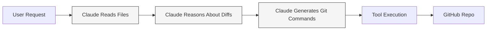
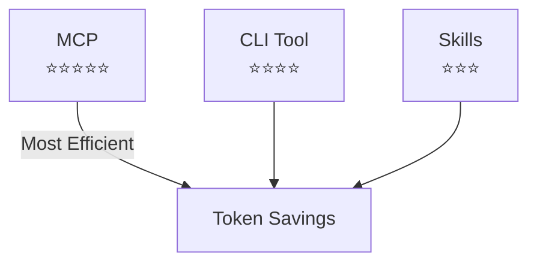

# Slide 1
## **How Claude Code Commits to GitHub**
…and how to dramatically reduce token usage.

#ClaudeCode #AIEngineering #TokenOptimization

---

# Slide 2 — The Problem
Claude must:
- Read files  
- Reason about diffs  
- Generate git commands  
- Execute tools  

Each step consumes **tokens**.  
Different workflows = different token costs.

# Slide 3 — Path‑1: Skills
Skills = Lean Context Automation

Token Flow:

Input ↓

Output ↓

Reasoning ↓

Context ↓

# Slide 4 — Path‑2: GitHub CLI Tool
CLI Tools = Offloading Git Logic

Token Flow:

Input ↓

Output ↓

Reasoning ↓↓↓

Context steady

# Slide 5 — Path‑3: MCP (Model Context Protocol)
MCP = Lowest Token Usage

Token Flow:

Input ↓↓↓

Output ↓↓

Reasoning ↓↓↓↓

Context minimal

# Slide 6 — Token Efficiency Ranking

# Slide 7 — Final Takeaway
For maximum token efficiency → Choose MCP  
For simple offloading → Use CLI tools  
For structured automation → Use Skills
